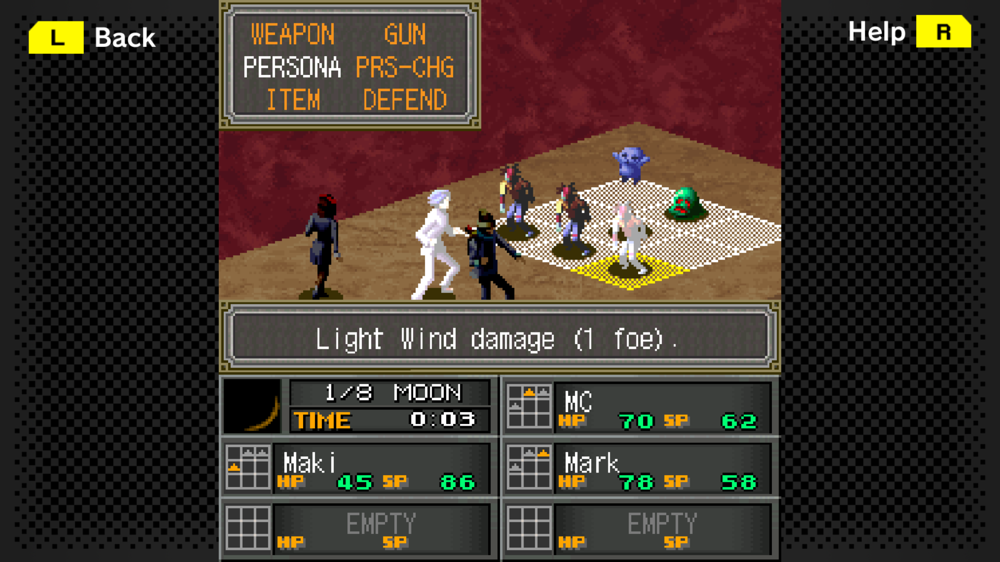
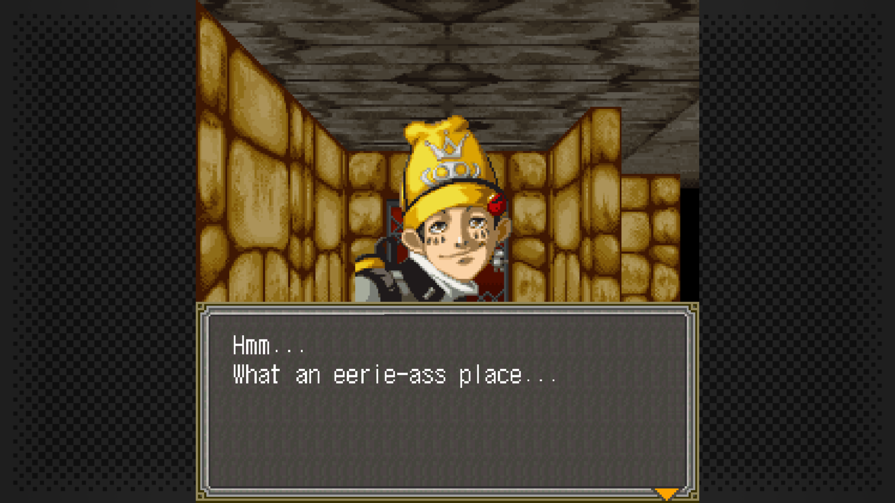
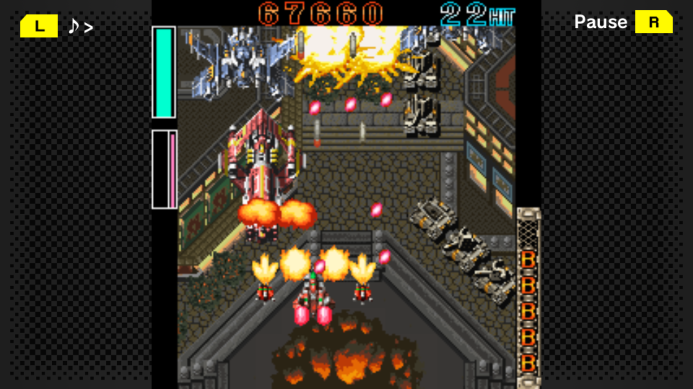
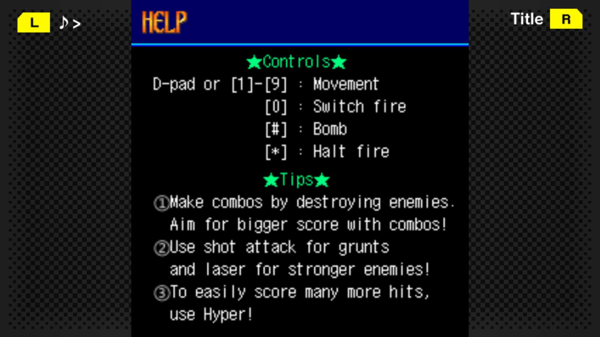
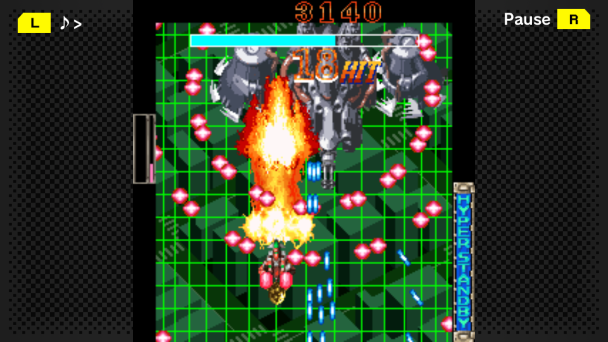
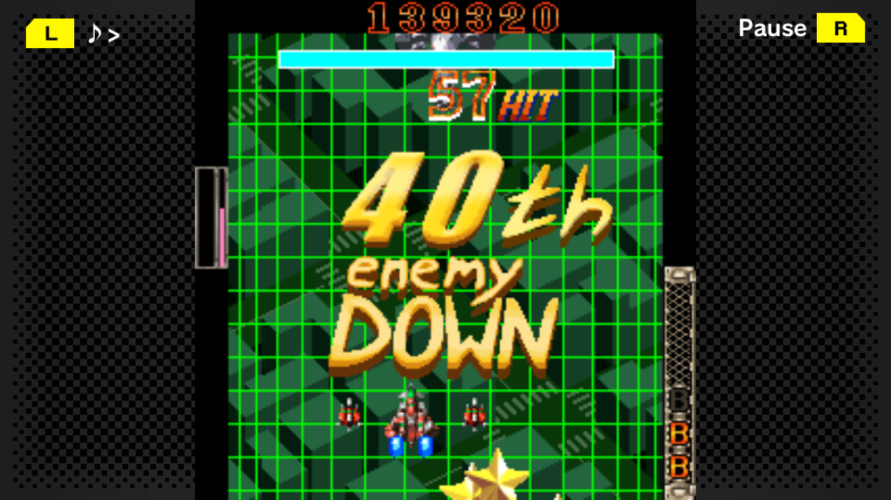
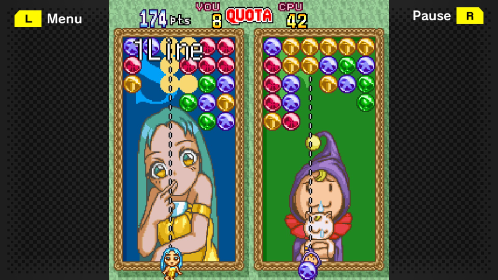
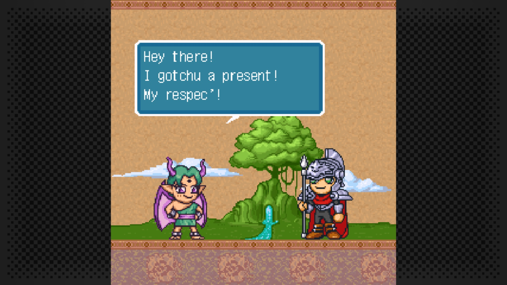

#  Translations
This is a repository of **translation** patches for the series of ports of mobile games that have been released on **Steam** and **Nintendo Switch** by .
As of now, the patches are only for the **Steam** version of these games.

### Download and Installation
A *link* to the *patch* and *Steam store page* is provided for each game.

The **Steam store image** beside a game's title links to the respective Steam store page.

Patching instructions are provided inside the **patch's archive file**.

---

##  女神異聞録ペルソナ 異空の塔編 (Persona - Anomalous Tower Chronicle)

### Download
- **English Patch**: [Version 1.0.0](https://github.com/MKCAMK/G-MODE-Archives-translations/raw/main/patches/Persona%20-%20Anomalous%20Tower%20Chronicle/English/Steam/Persona-AnomalousTowerChronicle_english_patch.1.0.0.zip)

### Notes
While this translation uses PSP localization of Persona 1 as a base, there are some deliberate <a href="patches/Persona - Anomalous Tower Chronicle/English/Steam/ATTRIBUTION.txt">**changes**</a> that differ from ATLUS official translation. Players who especially played PSP localization version recommended to cross-reference this to avoid confusion.

### Credits
The people who involved are unique to this translation which you can see it <a href="patches/Persona - Anomalous Tower Chronicle/English/Steam/ATTRIBUTION.txt">**here**</a>

---

##  怒首領蜂大往生DX (DoDonPachi Dai-Ou-Jou DX)

### Download
- **English Patch**: [Version 1.3.1](https://github.com/MKCAMK/G-MODE-Archives-translations/raw/main/patches/DoDonPachi%20Dai-Ou-Jou%20DX/English/Steam/DoDonPachiDaiOuJouDX_english_patch.1.3.1.zip)

---

##  弾幕検定死験-大往生編- (Deadly Danmaku Trial - DoDonPachi Dai-Ou-Jou Edition)

### Download
- **English Patch**: [Version 1.0.1](https://github.com/MKCAMK/G-MODE-Archives-translations/raw/main/patches/Deadly%20Danmaku%20Trial%20-%20DoDonPachi%20Dai-Ou-Jou%20Edition/English/Steam/DDT_DoDonPachiDaiOuJou_english_patch.1.0.1.zip)

---

##  マジカルドロップDX (Magical Drop DX)

### Download
- **English Patch**: [Version 1.0.0](https://github.com/MKCAMK/G-MODE-Archives-translations/raw/main/patches/Magical%20Drop%20DX/English/Steam/MagicalDropDX_english_patch.1.0.0.zip)

---

*Please support the publisher and developers whenever possible!*
